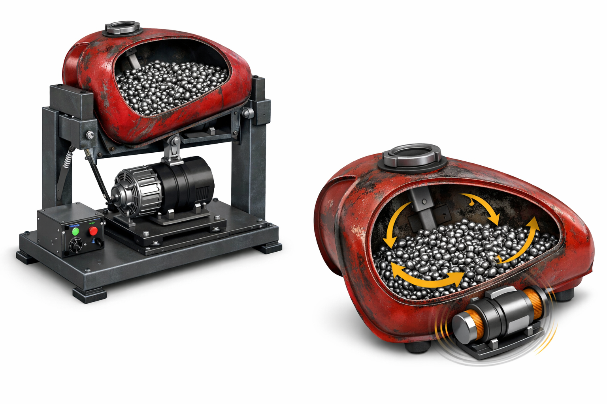
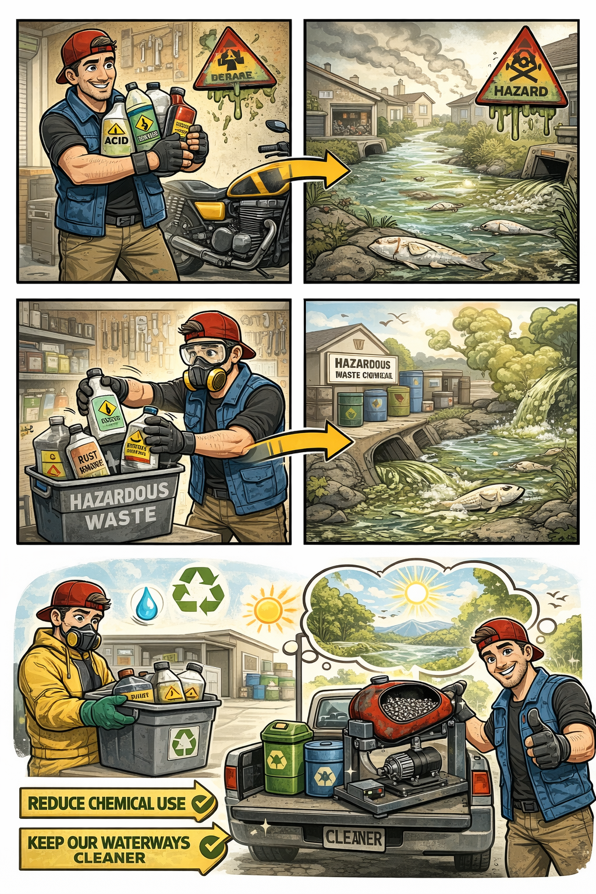

# Vybrokor

---

---

---
*Concept visualization — Vybrokor mechanical cleaning system*

**An open mechanical system designed to reduce chemical-based motorcycle fuel tank cleaning.**

---

## What is Vybrokor?

Vybrokor is a vibration-based mechanical approach to cleaning the inside of motorcycle fuel tanks using reusable media instead of harsh chemicals.

Traditional tank restoration methods often rely on acids, rust removers, degreasers, and liners — many of which end up entering drains, soil, and waterways due to inconsistent disposal practices.

Vybrokor exists to offer an alternative.

---

## Why This Matters

This project is released openly to encourage:

- real-world adoption  
- environmental impact reduction  
- practical innovation in garages and workshops  

If this system replaces even a small percentage of chemical cleaning methods, it is a step in the right direction.

---

## Public Release Status

This repository represents the **initial public documentation release**.

📄 Full documentation:  
👉 [`docs/vybrokor-public-release-v1.md`](docs/vybrokor-public-release-v1.md)

---

## CAD Files (Planned Release)

Full CAD files will be released after a working physical model has been tested and finalized.

Planned formats:

- `.stl`  
- `.step`  

Additional formats may be provided where practical.

---

## Open License

This project is released under the **MIT License**.

You are free to:

- use  
- modify  
- build  
- sell  

This is intentional.

**Adoption > restriction**

---

## Origin

Released publicly by **Jason Rubin**  
As a **MotoKor initiative**

---

## Final Note

If you build this, improve it, or take it further — you are part of the solution.
